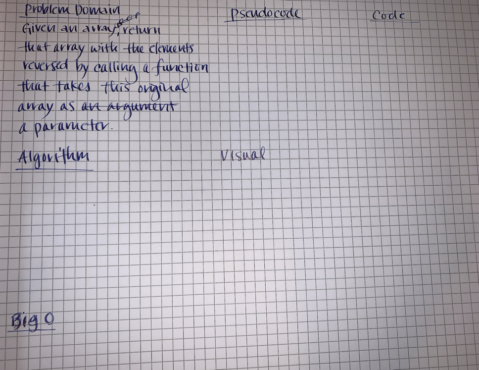

# Code Challenge - Class 01

# Reverse an Array
<!-- Short summary or background information -->

### Author: Diana Kim

### Links and Resources

- [submission PR](http://xyz.com)
- [ci/cd](https://github.com/dianakim/data-structures-and-algorithms/actions)

## Challenge
<!-- Description of the challenge -->

## Approach & Efficiency
<!-- What approach did you take? Why? What is the Big O space/time for this approach? -->

## Solution
<!-- Embedded whiteboard image -->

### Setup
* `npm install`

#### `.env` requirements (where applicable)

i.e.

- `PORT` - Port Number
- `MONGODB_URI` - URL to the running mongo instance/db

#### How to initialize/run your application (where applicable)

- e.g. `npm start`

#### How to use your library (where applicable)

#### Tests

* Unit Tests: `npm test`
* Lint Tests: `npm run lint`

#### UML

#### Whiteboard

