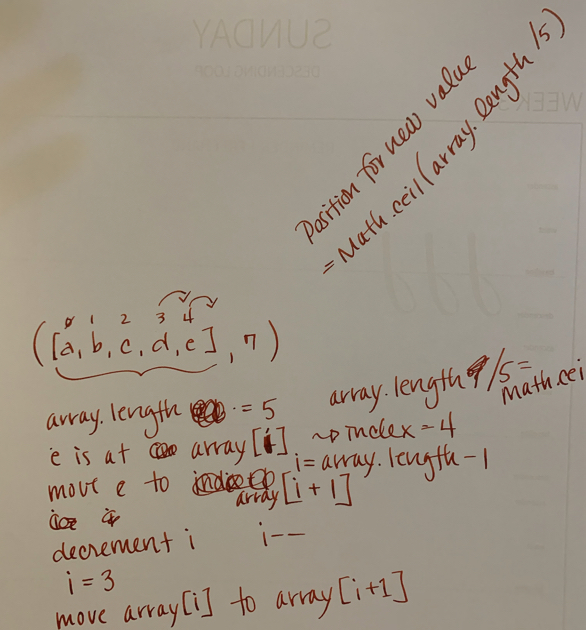

# Code Challenge - Class 02

# Insert and shift an array in middle at index

### Author: Diana Kim

### Links and Resources

- [submission PR](https://github.com/dianakim/data-structures-and-algorithms/pull/31)
- [ci/cd](https://github.com/dianakim/data-structures-and-algorithms/actions)

## Challenge
Write a function called insertShiftArray which takes in an array and the value to be added. Without utilizing any of the built-in methods available to your language, return an array with the new value added at the middle index.

## Approach & Efficiency
<!-- What approach did you take? Why? What is the Big O space/time for this approach? -->

## Solution

